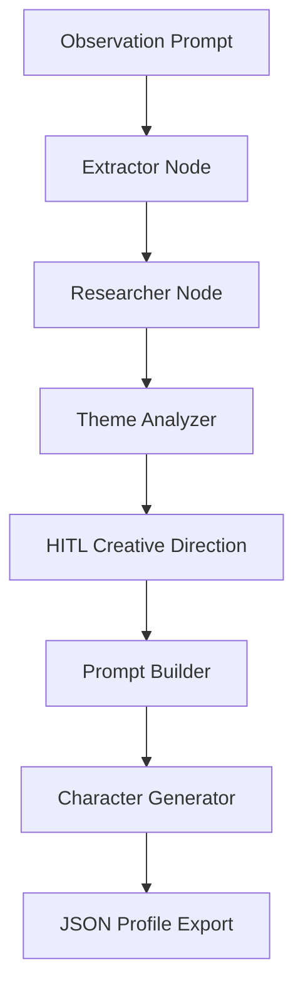

<div align="center">
  

  # Storysmith
  *Multi-agent narrative ideation system for game writers*

  [](https://www.python.org)
  [](https://github.com/langchain-ai/langgraph)
  [](LICENSE)

  ⭐ If you like this project, star it on GitHub!

  [Features](#features) • [Pipeline Architecture](#pipeline-architecture) • [Getting Started](#getting-started) • [Usage](#usage)

</div>

---

**Storysmith** is an opinionated, multi-agent narrative ideation pipeline designed to help writers discover rich, contradictory, and deeply grounded NPCs. 

Instead of writing stories or replacing authors, Storysmith uses structured reasoning to turn simple, flat behavioral observations (e.g. *"an autorickshaw driver who orders two meals but only eats one"*) into complex, game-ready character profiles containing unique signature details, psychological motivations, and narrative hooks.

Storysmith V1 is configured around **Shifts**, a slice-of-life narrative game set at a beachside food stall in Mumbai.

> [!NOTE]
> **Active Development:** This project is currently in active development. The current implementation represents **Storysmith V1**, focusing on slice-of-life narrative design for the game *Shifts*.

---

## Design Philosophy

Storysmith is built on three core beliefs:
- **Writers are irreplaceable:** The system does not write stories or produce dialogue; it generates structured reasoning and visual details to feed a writer's imagination.
- **Possibilities, not canon:** Every generated character is a launchpad of ideas and psychological opportunities, not a rigid, finished script.
- **Observation over biography:** Memorable characters are defined by how they move and act in the present, not by checklists of static background traits.

---

## Features

- 🎯 **Behavior-First Characterization:** Focuses on physical actions, repeated rituals, and signature habits rather than flat demographic checklists.
- 🕵️ **Structural Tension & Contradictions:** Explicitly extracts psychological contradictions that make NPCs feel alive and human.
- 🌐 **Grounded Research Integration:** Integrates real-world local setting context and cultural research to keep character backgrounds authentic.
- 🎛️ **Human-in-the-Loop (HITL) Direction:** Pause points where you select the target mood, thematic focus, and mystery handling before the profile is generated.
- 🎥 **Cinagonist Lens:** Appends a cinematic first-impression block written through the eyes of the game's protagonist (eg. a failed filmmaker).

---

## Pipeline Architecture

Storysmith is powered by a stateful [LangGraph](https://github.com/langchain-ai/langgraph) state machine:



Unlike a single monolithic LLM prompt, Storysmith decomposes character generation into specialized reasoning stages. Each node has exactly one responsibility, allowing raw observations, local research, thematic analysis, and creative direction to remain clean, transparent, and controllable throughout the pipeline.

1. **Extractor (Groq/Llama 3.3 70B):** Dissects raw input to isolate observable facts, contradictions, and topics for research.
2. **Researcher (Tavily):** Conducts real-time queries focusing on cultural nuances and human experiences in Mumbai.
3. **Theme Analyzer (Gemini 3.5 Flash):** Synthesizes research into thematic arrays (struggles, coping mechanisms, fears).
4. **HITL Interruption:** Pauses pipeline in the terminal to request user direction (Mood, Focus, Mystery handling).
5. **Prompt Builder & Generator (Gemini 3.5 Flash):** Combines state data to compile a complete character sheet with writer opportunities.

---

## Getting Started

### Prerequisites

- Python 3.10+
- Groq, Tavily, and Gemini API keys.

### Installation

1. Clone the repository:
   ```bash
   git clone https://github.com/your-username/storysmith.git
   cd storysmith
   ```

2. Set up a virtual environment and install dependencies:
   ```bash
   python -m venv venv
   source venv/bin/activate  # On Windows: venv\Scripts\activate
   pip install -r requirements.txt
   ```

3. Create a `.env` file in the root directory and add your API keys:
   ```env
   GROQ_API_KEY=your_groq_api_key
   TAVILY_API_KEY=your_tavily_api_key
   GOOGLE_API_KEY=your_gemini_api_key
   ```

---

## Usage

### 1. Configure Your World
Before running Storysmith, edit the `project_context.json` file in the root directory. This file acts as the "bible" for your game's world, protagonist, and narrative rules. Fill in the placeholder template fields with your specific project's details so the AI generates characters that fit your exact setting.

### 2. Run the Pipeline
```bash
python main.py
```

> [!IMPORTANT]
> **Windows Users:** The pipeline logs UTF-8 characters (`★`). You must set your console encoding to UTF-8 before running the command to avoid encoding crashes:
> ```powershell
> $env:PYTHONIOENCODING="utf-8"
> python main.py
> ```

### How to Run:
1. Enter a simple behavioral prompt in the terminal when prompted.
2. The pipeline will analyze facts, topics, and themes.
3. Choose the creative direction at the interrupt prompts (select mood, focus, mystery handling).
4. The system will compile and output the finished JSON character sheet under `exports/`.

---

## V2 Roadmap

Planned vision improvements for the next iteration of Storysmith:
- **General-purpose writing mode:** Support for arbitrary settings, genres, and narrative structures beyond the *Shifts* framework.
- **Recurring character memory:** The system remembers previously generated characters, enabling encounters that evolve over time.
- **Narrative continuity:** Cross-referencing generated characters to construct subplots and relationships between them.
- **Dialogue ideation:** Generating interactive conversation trees and branching response possibilities.
- **Multiple narrative settings:** Easily switch between different game locations and world contexts.

---

## Connect

Designed and built by **Mohd Ayaan Khan**. Feel free to reach out for collaborations, discussions, or just to talk narrative design!

[](https://www.linkedin.com/in/mohd-ayaan-khan-1127762b0/)
[](mailto:mohdayaankhan200@gmail.com)

